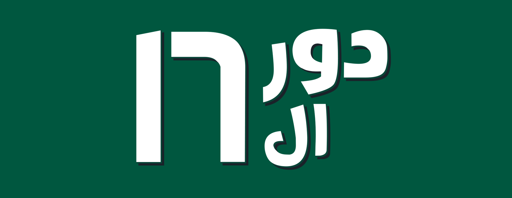
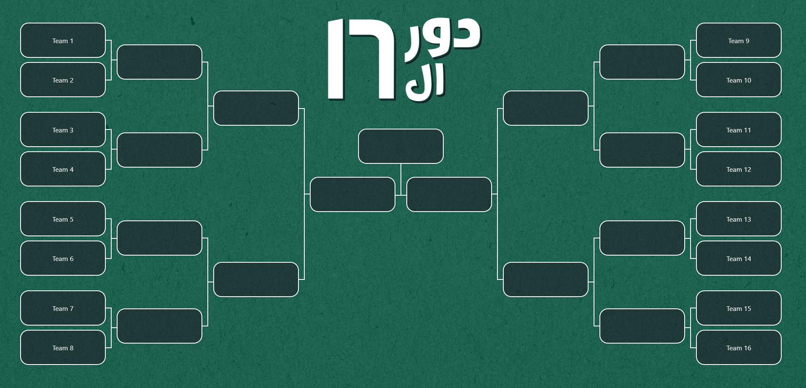
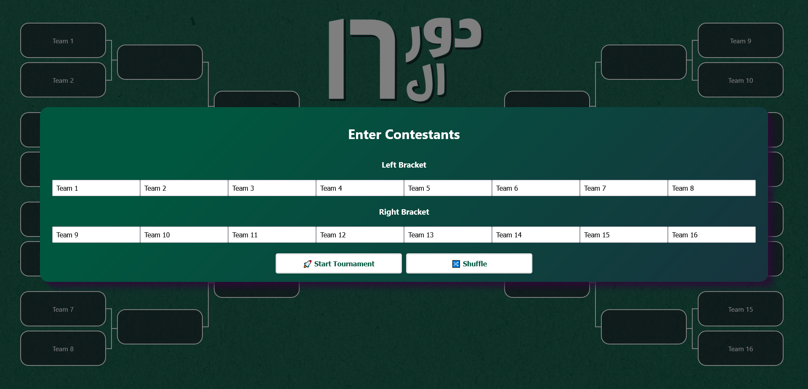
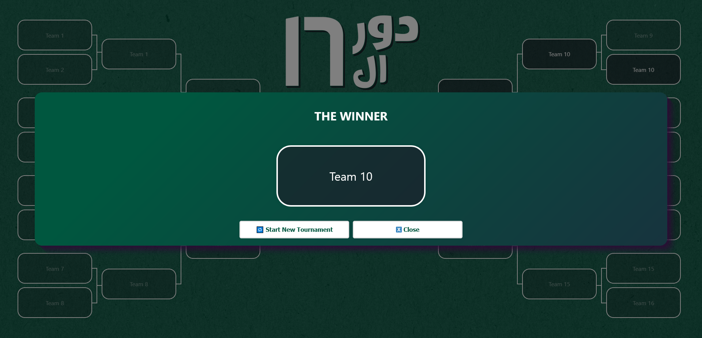
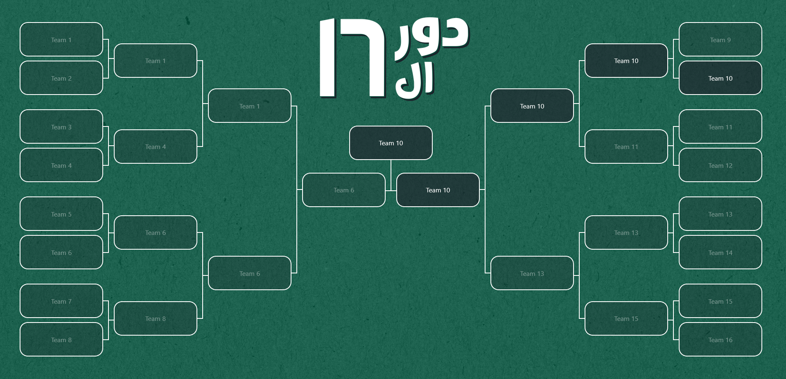

# **Dor El-16 (دور الـ 16)** 🏆  
**A Round of 16 Knockout Tournament Bracket built with ReactJS**

---

## **Overview**  
**Dor El-16 (دور الـ 16)** is a dynamic knockout bracket designed for 16 teams, built using **ReactJS.** Users can input team names, shuffle matchups, select winners, and watch the bracket dynamically update as teams progress. Losers fade out with a smooth animation, enhancing the visual experience of each elimination round.

---

## **Features**  
- **Customizable Inputs**:  
  Users can type custom team names, personalizing the bracket.  

- **Shuffle Button**:  
  Randomize matchups with the press of a button, creating unique paths for the tournament.  

- **Winner Selection**:  
  Click to choose winners, who will automatically advance to the next round.  

- **Dynamic Loser Animation**:  
  When a team loses, it fades out dynamically, enhancing the knockout effect.  

- **Reset Button**:  
  Allows users to restart the tournament at the end.  

---

## **Technologies Used**  
- **ReactJS**:  Handles the frontend UI and manages the app’s state effectively.  
- **CSS3**:  Provides the styling, layout, and animations for smooth fade-out transitions and responsive behavior.  
- **JavaScript (ES6)**:  Powers the knockout bracket logic, including winner selection, round progressions, and button functionality.  

---
## **Screenshots**

-Bracket


-User Input Screen


-User Input Screen


-User Input Screen


---
## How to Run the Project Locally  

Clone the project

```bash
  git clone https://github.com/AMaherJK/dor-el-16
```

Go to the project directory

```bash
  cd my-project
```

Install dependencies

```bash
  npm install
```

Start the server

```bash
  npm run start
```
---

## Credits
Developed by **Ahmed Maher**

## Feedback
If you have any feedback, please reach out to me at AMaherJK@gmail.com
